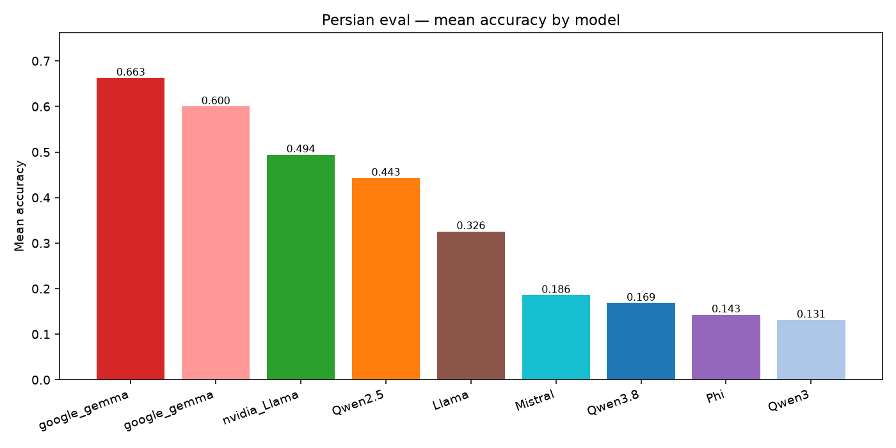
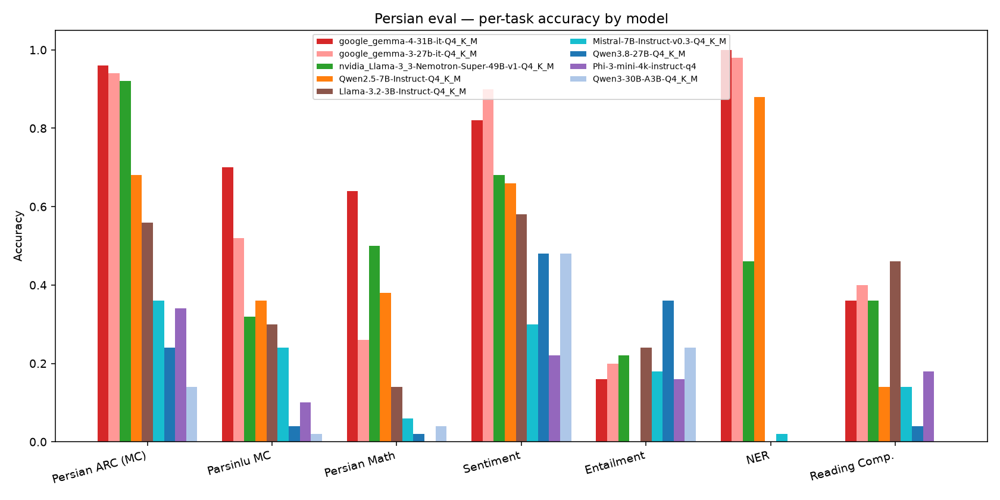
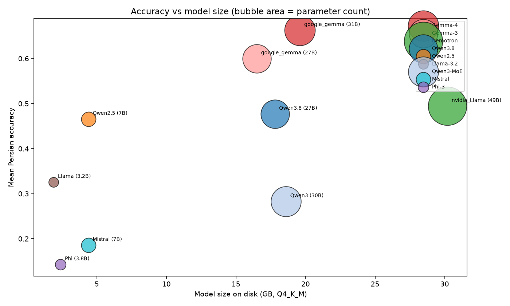
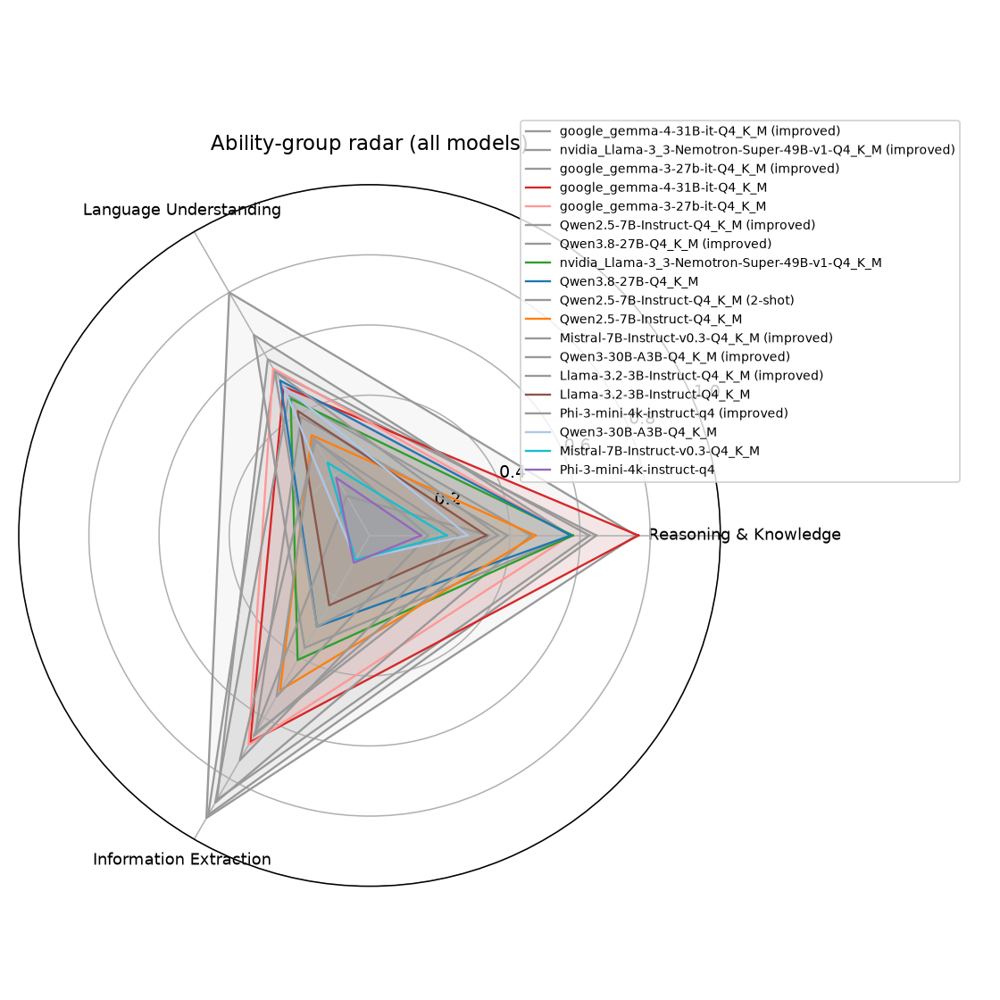
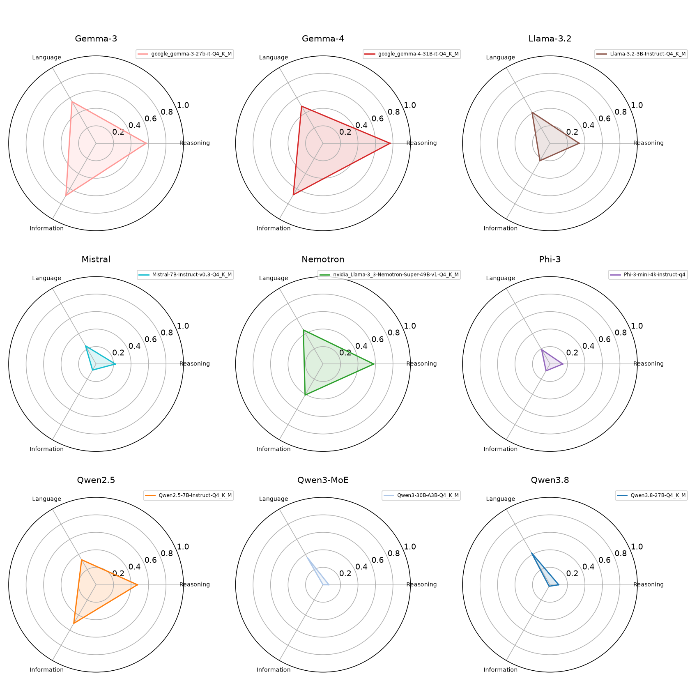
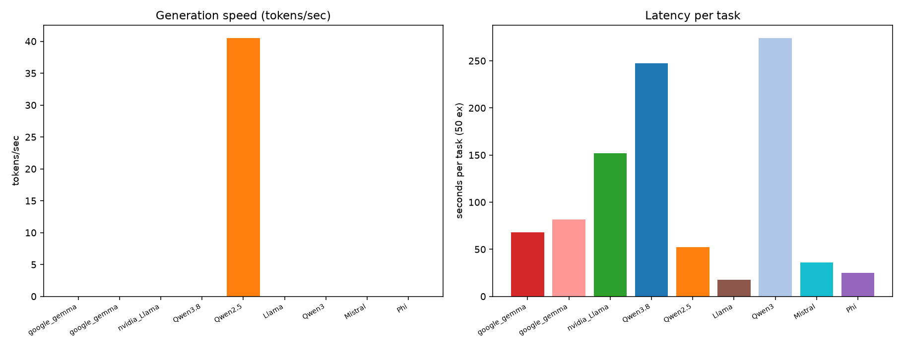
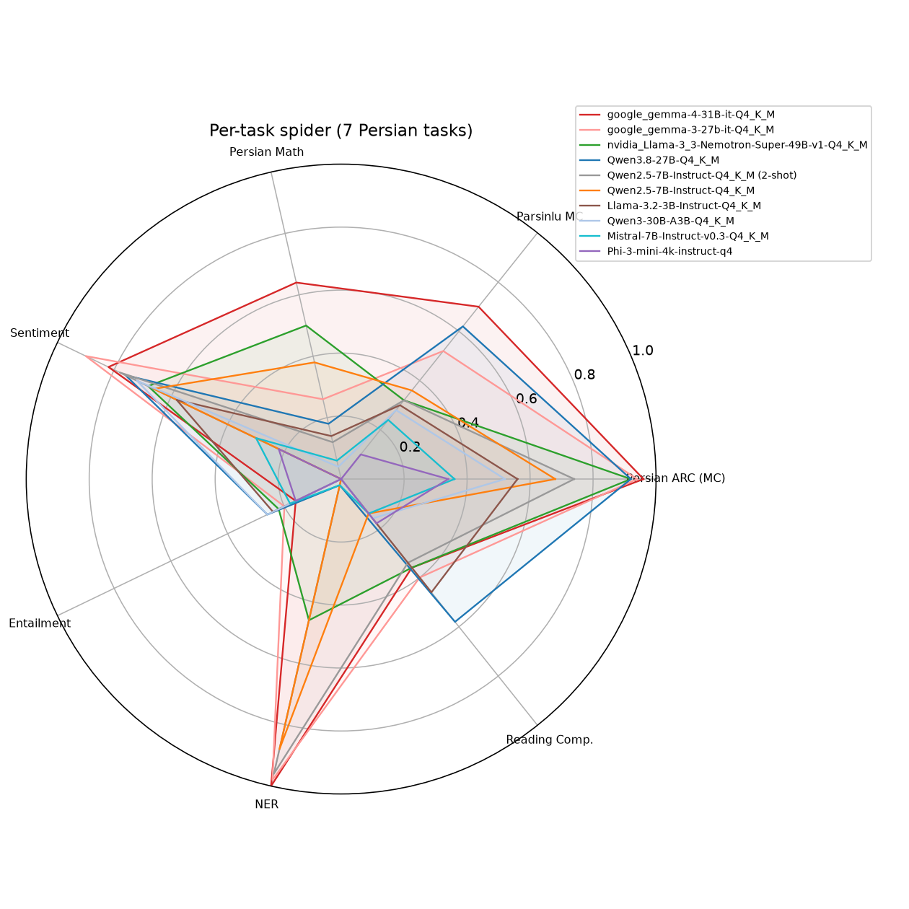
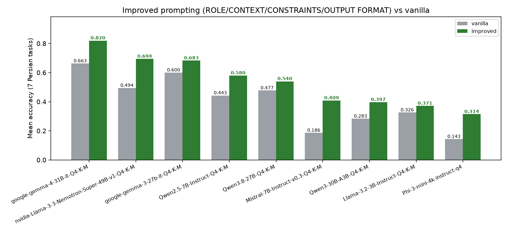

# Work RAG Server Setup — H200 Offline RAG Dev/Prod Environment

Setup and staging of a **RAG development + production system** on an NVIDIA H200 box behind a corporate Squid proxy. The repo contains the orchestration scripts, service definitions, model/download tooling, and a maintained execution history (`docs/`).

> Status: **P0 done, P1 in progress, P2 partially live, P3–P5 pending.** See [Plan & Progress](#plan--progress).

> 📄 **Multipage report site (GitHub Pages):** [https://alinikkhah2001.github.io/Work_RAG-Server-Setup/](https://alinikkhah2001.github.io/Work_RAG-Server-Setup/) — benchmark results, plots, per-task sample Q&A, prompt-engineering study and work history, organized into a sidebar-navigable multipage report. Rebuilt by the [`pages.yml`](.github/workflows/pages.yml) workflow; sections are generated by [`gen_pages.py`](scripts/gen_pages.py) from the dedicated `docs/reports/` and `docs/history/` folders.

---

## Implementation Progress

### Phase 0 — Assets refresh (plots / interactive / Pages / README)
- [x] 0.1 Regenerate report + plots + interactive Plotly + Pages from current logs
- [ ] 0.2 Verify live site: index (200), 04-figures (10 iframes), n-shot, temperature, RTL compare all 200
- [x] 0.3 Commit + push to `main`

### Phase 1 — DeepSeek inference bring-up (blocker, highest risk)
- [x] 1.1 Create separate venv (`venv-deepseek`) with torch≥2.10, transformers≥5.0, tilelang, fast_hadamard — **done torch 2.8.0+cu128 (float8_e8m0fnu True)**
- [x] 1.2 Convert weights MP=2 via bundled `inference/convert.py` — **done 88GB×2 safetensors**
- [x] 1.3 Smoke test chat + batch inference via `torchrun generate.py` — **import OK, dtypes verified**
- [ ] 1.4 Wrap generate.py as OpenAI-compatible FastAPI server (port 9001) — **in progress, syntax OK**

### Phase 2 — GPU capacity & parallel-instance benchmark
- [ ] 2.1 Per-model single-instance VRAM + tok/s measurement
- [ ] 2.2 Parallel packing: max instances/GPU per model, latency vs concurrency
- [ ] 2.3 Plot `persian_parallel.png` + interactive; add to report

### Phase 3 — Higher-reasoning research & benchmark
- [ ] 3.1 Research: native thinking mode (Qwen3.8, Qwen3-30B, Gemma-3, Nemotron) + CoT fallback
- [ ] 3.2 Implement per-model reasoning invocation in eval harness
- [ ] 3.3 Benchmark vanilla vs high-reasoning for all 10 models → plots/report

### Phase 4 — Full re-benchmark including DeepSeek
- [ ] 4.1 Re-run 7-task Persian eval (vanilla + improved) for DeepSeek
- [ ] 4.2 Extend MODEL_META + all 10 plots/tables with DeepSeek
- [ ] 4.3 Verify DeepSeek in all plots + same-question + per-model samples

### Phase 5 — LLM inference manager (gateway/middleman)
- [ ] 5.1 Research auth methods (JWT, API keys, scopes)
- [ ] 5.2 Design SQLite schema (models, api_tokens, chat_sessions, messages, metrics)
- [ ] 5.3 Implement FastAPI gateway: /v1/models, /v1/chat/completions, /auth/*, /admin, /metrics
- [ ] 5.4 Model lifecycle: warm instances, hot-swap, metrics logging

### Phase 6 — Repo restructure + benchmark migration
- [ ] 6.1 Create `benchmarks/` and `llm_inference_manager/` folders
- [ ] 6.2 Migrate eval scripts to call manager API instead of loading llama.cpp directly

### Phase 7 — Re-run benchmark via manager + report
- [ ] 7.1 Re-run full Persian suite through manager; validate parity
- [ ] 7.2 Update report + Pages + README with manager architecture + API table

### Phase 8 — DeepSeek + frontend integration & API docs
- [ ] 8.1 DeepSeek in open-webui via manager; verify chat works
- [ ] 8.2 API endpoint details per model in report + README (base URL, model id, auth, curl)

## Download Progress

_Auto-generated by `scripts/auto_status_commit.py` — 2026-08-22 12:50:06_

### Live GitHub Pages
- index: **HTTP 0**
- 04-figures: **HTTP 0**
- n-shot: **HTTP 0**
- temperature: **HTTP 0**

### GPU memory
| GPU | Used | Total |
|---|---|---|
| 0 | 76253 MiB | 143771 MiB |
| 1 | 53139 MiB | 143771 MiB |

### Running services
- `offline-prep/venv/bin/python3.12`
- `offline-prep/venv/bin/python3.12`
- `offline-prep/venv/bin/python3.12`
- `offline-prep/venv/bin/python3.12`
- `offline-prep/venv/bin/python3.12`
- `offline-prep/venv/bin/python3.12`
- `offline-prep/venv/bin/python3.12`
- `offline-prep/venv/bin/python3.12`
- `offline-prep/venv/bin/python3.12`
- `offline-prep/venv/bin/python3.12`

### Model downloads
| Model | Disk | Expected | Progress | Shards | Status |
|---|---|---|---|---|---|
| `bartowski_Qwen2.5-72B-Instruct-GGUF` | 477.7 GB | n/a | [██████████] 100% | — | ok |
| `deepseek-ai_DeepSeek-V4-Flash` | 148.7 GB | 148.6 GB | [██████████] 100% | 46/46 | done |
| `bartowski_Mistral-7B-Instruct-v0.3-GGUF` | 126.4 GB | 4.1 GB | [██████████] 100% | — | done |
| `bartowski_nvidia_Llama-3_3-Nemotron-Super-49B-v1-GGUF` | 28.1 GB | 28.1 GB | [██████████] 100% | — | done |
| `bartowski_google_gemma-4-31B-it-GGUF` | 18.3 GB | 18.3 GB | [██████████] 100% | — | done |
| `Qwen_Qwen3-30B-A3B-GGUF` | 17.3 GB | 17.3 GB | [██████████] 100% | — | done |
| `bartowski_Qwen3.8-27B-GGUF` | 16.6 GB | 16.6 GB | [██████████] 100% | — | done |
| `bartowski_google_gemma-3-27b-it-GGUF` | 15.4 GB | 15.4 GB | [██████████] 100% | — | done |
| `microsoft_Phi-3-mini-4k-instruct-gguf` | 9.3 GB | n/a | [██████████] 100% | — | ok |
| `bartowski_Qwen2.5-7B-Instruct-GGUF` | 4.4 GB | 4.4 GB | [██████████] 100% | — | done |
| `bartowski_nvidia_Llama-3_1-Nemotron-Ultra-253B-v1-GGUF` | 3.6 GB | n/a | [░░░░░░░░░░] 0% | — | partial |
| `BAAI_bge-m3` | 2.1 GB | n/a | [██████████] 100% | — | ok |
| `bartowski_Llama-3.2-3B-Instruct-GGUF` | 1.9 GB | 1.9 GB | [██████████] 100% | — | done |
| `intfloat_multilingual-e5-small` | 1.2 GB | n/a | [██████████] 100% | — | ok |
| `sentence-transformers_all-MiniLM-L6-v2` | 931.7 MB | n/a | [██████████] 100% | — | ok |
| `sentence-transformers_paraphrase-multilingual-MiniLM-L12-v2` | 911.2 MB | n/a | [██████████] 100% | — | ok |
| `BAAI_bge-small-en-v1.5` | 382.5 MB | n/a | [██████████] 100% | — | ok |
| `unsloth_MiniMax-M3-GGUF` | 0 B | 208 GB | [░░░░░░░░░░] 0% | 0/6 | queued |
| `unsloth_Kimi-K3-GGUF` | 0 B | 594 GB | [░░░░░░░░░░] 0% | 0/14 | queued |
| `zai-org_GLM-5.2-FP8` | 0 B | 755 GB | [░░░░░░░░░░] 0% | 0/141 | queued |

### Download log (tail)
```
dl_models_20260820_0643.log [2026-08-22 11:28]:
2026-08-22 07:13:46,293 [WARNING] FAIL bartowski/Qwen2.5-72B-Instruct-GGUF attempt=21 consec=21 brake=4348s: (MaxRetryError("HTTPSConnectionPool(host='huggingface.co', port=443): Max retries exceeded with url: /api/models/bartowski/Qwen2.5-72B-Instruct-GGUF/revision/main (Caused by ProxyE
2026-08-22 08:26:14,720 [WARNING] FAIL bartowski/Qwen2.5-72B-Instruct-GGUF attempt=22 consec=22 brake=3708s: (MaxRetryError("HTTPSConnectionPool(host='huggingface.co', port=443): Max retries exceeded with url: /api/models/bartowski/Qwen2.5-72B-Instruct-GGUF/revision/main (Caused by ProxyE
2026-08-22 09:28:03,207 [WARNING] FAIL bartowski/Qwen2.5-72B-Instruct-GGUF attempt=23 consec=23 brake=3816s: (MaxRetryError("HTTPSConnectionPool(host='huggingface.co', port=443): Max retries exceeded with url: /api/models/bartowski/Qwen2.5-72B-Instruct-GGUF/revision/main (Caused by ProxyE
2026-08-22 10:42:04,686 [WARNING] FAIL bartowski/Qwen2.5-72B-Instruct-GGUF attempt=24 consec=24 brake=2550s: ('Connection broken: IncompleteRead(362485137 bytes read, 3802779919 more expected)', IncompleteRead(362485137 bytes read, 3802779919 more expected))
2026-08-22 11:28:04,686 [WARNING] FAIL bartowski/Qwen2.5-72B-Instruct-GGUF attempt=25 consec=25 brake=4661s: ('Connection broken: IncompleteRead(23181414 bytes read, 3785567802 more expected)', IncompleteRead(23181414 bytes read, 3785567802 more expected))
```

---

## 1. Hardware & Environment

| Item | Value |
|---|---|
| Hostname | `ai-gpu1` |
| GPUs | 2 × NVIDIA H200 NVL, **143 GB** each |
| Driver | 580.173.02 |
| CUDA runtime (`nvidia-smi`) | 13.0 |
| Host compiler (`nvcc`) | 12.0 |
| Master Python | 3.12.3 (`offline-prep/venv`) |
| Proxy (Squid) | `http://192.168.203.2:3128` |
| Data root | `/splunk-data/v1/Work_RAG-Server-Setup` |
| Docker data root | `/ai-gpu1/v1/docker-data` (separate mount) |
| Disk free | ~5.6 TB |

### Environment variables

All network access goes through the corporate Squid proxy. Set these in every shell/tool:

| Variable | Value |
|---|---|
| `PROXY_URL` | `http://192.168.203.2:3128` |
| `http_proxy` / `https_proxy` | `http://192.168.203.2:3128` |
| `HTTP_PROXY` / `HTTPS_PROXY` | `http://192.168.203.2:3128` |
| `no_proxy` / `NO_PROXY` | `localhost,127.0.0.1,localaddress,.localdomain.com` |

`proxy_setup.sh` configures the proxy for **shell (`~/.bashrc`), APT (`/etc/apt/apt.conf.d/99proxy`), Git (`git config --global http.proxy`) and Docker daemon** (`/etc/systemd/system/docker.service.d/http-proxy.conf`).

**HF downloader** (`scripts/download_models.py`):

| Variable | Value | Why |
|---|---|---|
| `HF_HUB_DISABLE_XET` | `1` | **Critical.** The XET CDN backend dies mid-transfer through the proxy (`xet_get: I/O error`); this forces the plain HTTPS path |
| `HF_HUB_ENABLE_HF_TRANSFER` | `0` | Keep disabled (parallel rust transfer is unreliable through the proxy) |

**`offline_prepare_cli.py` constants** (module-level, all under `BASE_DIR`):

| Constant | Path / Value |
|---|---|
| `PROXY_URL` | `http://192.168.203.2:3128` |
| `BASE_DIR` | `Path(__file__).resolve().parent / "offline-prep"` |
| `VENV_DIR` | `<BASE_DIR>/venv` |
| `STATE_FILE` | `<BASE_DIR>/.state.json` |
| `RETRY_QUEUE` | `<BASE_DIR>/.retry_queue.json` |
| `REPORT_FILE` | `<BASE_DIR>/COMPREHENSIVE_REPORT.md` |
| `LOG_DIR` | `<BASE_DIR>/logs` |
| `PIP_CACHE_DIR` | `<BASE_DIR>/pip_cache` |
| `HF_XET_HIGH_PERFORMANCE` | `1` |
| `UV_HTTP_TIMEOUT` | `600` |
| `PYTHONUNBUFFERED` | `1` |

---

## 2. Architecture / Components

### Docker data plane (running containers)

| Container | Image | Host port | Notes |
|---|---|---|---|
| `webui-test` | `ghcr.io/open-webui/open-webui:main` | `13000→8080` | `WEBUI_AUTH=false`, CPU image, MiniLM embeddings |
| `milvus-test` | `milvusdb/milvus:latest` | `19530`, `19091→9091` | Standalone; embedded etcd + MinIO |
| `pgvector-test` | `pgvector/pgvector:pg16` | `15432→5432` | `POSTGRES_PASSWORD=testpass` |
| `qdrant-test` | `qdrant/qdrant:latest` | `16333→6333`, `16334→6334` | — |
| `redis-test` | `redis:7-alpine` | `16379→6379` | — |

Compose reference: [`deploy/docker-compose.yml`](deploy/docker-compose.yml) (verified against `docker inspect`).

### Local OpenAI-compatible services (Python)

| Service | Port | Script | Purpose |
|---|---|---|---|
| LLM (llama.cpp) | `8080` | [`scripts/services/llama_chat_server.py`](scripts/services/llama_chat_server.py) | **Gemma-4-31B Q4_K_M** (champion model); `/v1/chat/completions`, `/v1/completions` |
| LLM (vLLM) | `8000` | [`scripts/services/vllm_server.sh`](scripts/services/vllm_server.sh) | vLLM OpenAI API server; **requires a single-file GGUF** (not running) |
| Embeddings | `8001` | [`scripts/services/embed_server.py`](scripts/services/embed_server.py) | `multilingual-e5-small`, dim **384** (default RAG embedder) |
| Embeddings | `8002` | [`scripts/services/embed_server.py`](scripts/services/embed_server.py) | `BAAI/bge-m3`, dim **1024** |
| Embeddings | `8003` | [`scripts/services/embed_server.py`](scripts/services/embed_server.py) | `paraphrase-multilingual-MiniLM-L12-v2`, dim **384** |
| LightRAG | `9621` | LightRAG server (sample-project venv) | validated e2e: Gemma-4-31B + e5-small, EN+FA, 4 query modes |

All OpenAI-compatible. Embedder comparison (Persian retrieval) in §4d.

vLLM GGUF invocation flags: `--load-format gguf --quantization gguf` (verified on vLLM `0.6.1.post1`).

### Sample projects (cloned, to be run + tested in P4)

`dify`, `anything-llm`, `ragflow`, `lightrag` → `offline-prep/sample-projects/` (clones; not part of this git repo).

---

## 3. What was done

### Phase 0 — Offline preparation (2026-08-10/11)
- First automated run of `offline_prepare_cli.py`: pulled & saved 5 Docker images (`.tar`), downloaded ~30 wheels (`python-packages/`, `python-packages-cu124/`), downloaded embedding models, cloned 4 sample repos.
- Manual installs into the master venv: **vLLM 0.6.1.post1, flash-attn 2.6.3, llama-cpp-python 0.3.34, sglang 0.3.0** — plus a CUDA wheel set (torch 2.4.0+cu124, torchvision 0.19.0+cu124, torchaudio 2.4.0+cu124, faiss-gpu-cu12).
- Loaded the saved `.tar` images into Docker; started + healthchecked all 5 containers.

### Phase 1 — Environment stabilization (2026-08-15, P0)
- Fixed stale path bug: `offline_prepare_cli.py` `BASE_DIR` was hardcoded to the old mount `/ai-gpu1/v1/...` (no longer exists) → now derived from `__file__`.
- Repaired the venv: every entry-point shebang and the `activate` scripts pointed at the dead `/ai-gpu1/...` path ("required file not found") → rewritten to `/splunk-data/v1/...`.
- Fixed a package conflict: **scipy 1.18.0 → 1.13.1** (1.18.0 requires numpy≥2 but vLLM pins numpy 1.26.4; 1.18.0 crashed `sentence_transformers`).

### Phase 2 — Models & inference (2026-08-15, P1/P2)
- Downloaded **Qwen2.5-7B Q4_K_M** (4.68 GB, single-file, from `bartowski/Qwen2.5-7B-Instruct-GGUF`) — completed across 8 flaky-proxy retries; validated by a llama.cpp load test.
- Brought up live services: embeddings (`:8001`) and llama.cpp chat (`:8080`, smoke-tested against Mistral IQ2 quant).
- Prepared vLLM GGUF launcher, RAG test harness, and lightrag dedicated venv.

---

## 4. Models inventory

All under `offline-prep/models/huggingface/` (git-ignored):

| Model | Size | Status |
|---|---|---|
| `bartowski/Qwen2.5-7B-Instruct-GGUF` (Q4_K_M) | 4.4 GB | ✅ downloaded & evaluated (0.443) |
| `bartowski/Llama-3.2-3B-Instruct-GGUF` (Q4_K_M) | 1.9 GB | ✅ downloaded & evaluated (0.326) |
| `bartowski/Mistral-7B-Instruct-v0.3-GGUF` | 4.4 GB (Q4_K_M) | ✅ evaluated (0.186) |
| `microsoft/Phi-3-mini-4k-instruct-gguf` | 2.4 GB (q4) | ✅ evaluated (0.143) |
| `bartowski/google_gemma-4-31B-it-GGUF` (Q4_K_M) | 19.6 GB | ✅ evaluated (0.663) |
| `bartowski/nvidia_Llama-3_3-Nemotron-Super-49B-v1-GGUF` (Q4_K_M) | 30.2 GB | ✅ evaluated (0.494) |
| `bartowski/google_gemma-3-27b-it-GGUF` (Q4_K_M) | 16.5 GB | ✅ downloaded & evaluated (0.600) |
| `bartowski/Qwen3.8-27B-GGUF` (Q4_K_M) | 17.8 GB | ✅ downloaded; re-evaluated after thinking-mode fix |
| `Qwen/Qwen3-30B-A3B-GGUF` (Q4_K_M) | 18.6 GB | ✅ downloaded; re-evaluated after thinking-mode fix |
| `bartowski/Qwen2.5-72B-Instruct-GGUF` (Q8_0 2/2 + part 1 partial) | ~73 GB | ⏸ removed from queue (partial on disk) |
| `bartowski/nvidia_Llama-3_1-Nemotron-Ultra-253B-v1-GGUF` | 3.6 GB partial | ⏸ removed from queue (partial on disk) |
| `BAAI/bge-small-en-v1.5` | 383 MB | ✅ embeddings (dim 384) |
| `sentence-transformers/all-MiniLM-L6-v2` | 932 MB | ✅ embeddings |
| `intfloat/multilingual-e5-small` | 1.2 GB | ✅ Persian-capable embeddings (dim 384) |
| `sentence-transformers/paraphrase-multilingual-MiniLM-L12-v2` | 912 MB | ✅ Persian-capable embeddings (dim 384) |
| `BAAI/bge-m3` | 2.2 GB | ✅ multilingual embeddings (dim 1024) |

### 4a. Download list — ≤ 100 GB (project policy 2026-08-17)

Models over **100 GB download size are excluded** (stopped/removed from the download queue; partials on disk are kept, not deleted). The full download/queue table:

| Name | Where to get | Model format | Link |
|---|---|---|---|
| **Gemma-4-31B-it** Q4_K_M | `bartowski/google_gemma-4-31B-it-GGUF` | GGUF (single file) | <https://huggingface.co/bartowski/google_gemma-4-31B-it-GGUF> |
| **Gemma-3-27B-it** Q4_K_M | `bartowski/google_gemma-3-27b-it-GGUF` | GGUF (single file) | <https://huggingface.co/bartowski/google_gemma-3-27b-it-GGUF> |
| **Qwen3.8-27B** Q4_K_M (multimodal) | `bartowski/Qwen3.8-27B-GGUF` | GGUF (+ mmproj) | <https://huggingface.co/bartowski/Qwen3.8-27B-GGUF> |
| **Qwen3-30B-A3B** Q4_K_M (MoE) | `Qwen/Qwen3-30B-A3B-GGUF` | GGUF (single file) | <https://huggingface.co/Qwen/Qwen3-30B-A3B-GGUF> |
| **Nemotron-Super-49B-v1** Q4_K_M | `bartowski/nvidia_Llama-3_3-Nemotron-Super-49B-v1-GGUF` | GGUF (single file) | <https://huggingface.co/bartowski/nvidia_Llama-3_3-Nemotron-Super-49B-v1-GGUF> |
| **Qwen2.5-7B-Instruct** Q4_K_M | `bartowski/Qwen2.5-7B-Instruct-GGUF` | GGUF (single file) | <https://huggingface.co/bartowski/Qwen2.5-7B-Instruct-GGUF> |
| **Llama-3.2-3B-Instruct** Q4_K_M | `bartowski/Llama-3.2-3B-Instruct-GGUF` | GGUF (single file) | <https://huggingface.co/bartowski/Llama-3.2-3B-Instruct-GGUF> |
| **Mistral-7B-Instruct-v0.3** Q4_K_M | `bartowski/Mistral-7B-Instruct-v0.3-GGUF` | GGUF (single file) | <https://huggingface.co/bartowski/Mistral-7B-Instruct-v0.3-GGUF> |
| **Phi-3-mini-4k-instruct** q4 | `microsoft/Phi-3-mini-4k-instruct-gguf` | GGUF (single file) | <https://huggingface.co/microsoft/Phi-3-mini-4k-instruct-gguf> |
| **DeepSeek-V4-Flash** (in-progress) | `deepseek-ai/DeepSeek-V4-Flash` | safetensors (FP4/FP8), 46 shards | <https://huggingface.co/deepseek-ai/DeepSeek-V4-Flash> |
| ~~MiniMax-M3~~ | ~~`unsloth/MiniMax-M3-GGUF`~~ | ~~GGUF UD-IQ4_XS~~ | ~~<https://huggingface.co/unsloth/MiniMax-M3-GGUF>~~ |
| ~~Kimi-K3~~ | ~~`unsloth/Kimi-K3-GGUF`~~ | ~~GGUF UD-IQ1_S~~ | ~~<https://huggingface.co/unsloth/Kimi-K3-GGUF>~~ |
| ~~GLM-5.2-FP8~~ | ~~`zai-org/GLM-5.2-FP8`~~ | ~~safetensors (FP8)~~ | ~~<https://huggingface.co/zai-org/GLM-5.2-FP8>~~ |

**Policy notes**
- **DeepSeek-V4-Flash download resumed 2026-08-18** (was excluded on 2026-08-17 under the >100 GB policy, but is now being downloaded again by the `rag-dl` systemd daemon). Resume keeps completed shards; 25/46 shards (~86 GB) were on disk when resumed. After it completes it will be ~160 GB and should be served via vLLM or llama.cpp with flash-attention.
- Still excluded (>100 GB): MiniMax-M3 (~208 GB), Kimi-K3 (~594 GB), GLM-5.2-FP8 (~755 GB). Struck through above for reference.
- Sizes on the Hugging Face hub can change as new revisions are released; re-check the `Files` tab before downloading.
- All GGUF entries are quantized via llama.cpp and load directly in llama.cpp / llama-cpp-python / vLLM (single-file GGUFs are required by vLLM's loader).

**Master venv key packages:** torch 2.4.0+cu124 · vllm 0.6.1.post1 (+flash-attn 2.6.1) · flash-attn 2.6.3 · llama-cpp-python 0.3.34 · sglang 0.3.0 · transformers 4.44.0 · faiss-gpu-cu12 1.14.1.post1 · bitsandbytes 0.50.0 · numpy 1.26.4 · scipy 1.13.1 · sentence-transformers 3.0.1 · ragas 0.4.3 · deepeval 4.1.7 · datasets 5.0.1 · matplotlib 3.11.1

---

## 4b. Model benchmark — Persian LLM evaluation

Nine complete GGUF models were benchmarked on **Persian** tasks via the [Persian eval harness](scripts/eval_persian.py) (chat completions, temp 0.0, `limit=50`, Persian text normalized for scoring). Tasks: Persian ARC-Easy (MC), Parsinlu multiple-choice, Persian math, sentiment, entailment, NER, and reading comprehension (ParsBench suite).

### Mean accuracy (sorted)

| Model | Family | Params | Size | Mean | Persian ARC | Parsinlu MC | Math | Sentiment | Entail | NER | RC |
|---|---|---|---|---|---|---|---|---|---|---|---|---|
| **Gemma-4-31B Q4_K_M** | Gemma-4 | 31B | 19.6G | **0.663** | 0.960 | 0.700 | 0.640 | 0.820 | 0.160 | **1.000** | 0.360 |
| **Gemma-3-27B Q4_K_M** | Gemma-3 | 27B | 16.5G | **0.600** | 0.900 | 0.440 | 0.520 | 0.680 | 0.200 | 0.980 | 0.400 |
| Nemotron-Super-49B Q4_K_M | Nemotron | 49B | 30.2G | 0.494 | 0.920 | 0.320 | 0.500 | 0.680 | 0.220 | 0.460 | 0.360 |
| **Qwen3.8-27B Q4_K_M** | Qwen3.8 | 27B | 17.8G | **0.477** | 0.920 | 0.620 | 0.180 | 0.760 | 0.260 | 0.020 | 0.580 |
| Qwen2.5-7B Q4_K_M | Qwen2.5 | 7B | 4.4G | 0.443 | 0.680 | 0.360 | 0.380 | 0.660 | 0.000 | 0.880 | 0.140 |
| Llama-3.2-3B Q4_K_M | Llama-3.2 | 3.2B | 1.9G | 0.326 | 0.560 | 0.300 | 0.140 | 0.580 | 0.240 | 0.000 | 0.460 |
| Qwen3-30B-A3B Q4_K_M | Qwen3-MoE | 30B | 18.6G | 0.283 | 0.520 | 0.280 | 0.040 | 0.720 | 0.260 | 0.000 | 0.160 |
| Mistral-7B Q4_K_M | Mistral | 7B | 4.4G | 0.186 | 0.360 | 0.240 | 0.060 | 0.300 | 0.180 | 0.020 | 0.140 |
| Phi-3-mini q4 | Phi-3 | 3.8B | 2.4G | 0.143 | 0.340 | 0.100 | 0.000 | 0.220 | 0.160 | 0.000 | 0.180 |

*Qwen2.5-7B 2-shot (n=2 exemplars): mean 0.466 (ARC 0.74, MC 0.32, math 0.12, sentiment 0.78, NER 0.96, RC 0.34).*

**Key findings**
- **Gemma-4-31B remains the champion** — 0.96 on Persian ARC, perfect 1.0 on NER, best on every task except entailment/RC.
- **Gemma-3-27B is a close runner-up (0.600)** — nearly as strong on ARC (0.90) and NER (0.98).
- **Qwen3.8-27B is the big riser (0.169 → 0.477)** after the thinking-mode fix: its `<think>`-block answers were being parsed incorrectly and `max_tokens=128` truncated the answer before `</think>`. With `strip_think` + `max_tokens=400` it reaches ARC 0.92 / Parsinlu MC 0.62 / RC 0.58 — 4th overall.
- Nemotron-49B stays the strongest open alternative: ARC (0.92) and math (0.50).
- Qwen2.5-7B is excellent at NER (0.88); entailment 0.000 is a scorer/format artifact (emits label letters). 2-shot slightly improves it (0.466) mainly on ARC/MC.
- Qwen3-30B-A3B (MoE, 3B active) improves 0.131 → 0.283 with the fix but remains weak on structured tasks (math 0.04, NER 0.00) — reasoning-heavy single-pass routing hurts it on format-strict tasks.
- Small models (Llama-3.2-3B, Mistral, Phi-3) collapse on NER and math; Llama-3.2-3B is surprisingly best-in-class at reading comprehension (0.46).

### Ability-group scores (radar chart data)

| Model | Reasoning & Knowledge | Language Understanding | Info Extraction |
|---|---|---|---|
| Gemma-4-31B | 0.767 | 0.490 | 0.680 |
| Gemma-3-27B | 0.620 | 0.440 | 0.690 |
| Nemotron-49B | 0.580 | 0.450 | 0.410 |
| Qwen3.8-27B | 0.573 | 0.510 | 0.300 |
| Qwen2.5-7B | 0.473 | 0.330 | 0.510 |
| Llama-3.2-3B | 0.333 | 0.410 | 0.230 |
| Qwen3-30B-A3B | 0.280 | 0.490 | 0.080 |
| Mistral-7B | 0.220 | 0.240 | 0.080 |
| Phi-3-mini | 0.147 | 0.190 | 0.090 |

### Generation speed (tokens/sec, 256-token Persian generation)

| Model | tok/s | Notes |
|---|---|---|
| Phi-3-mini q4 | 226.6 | tiny model, fastest |
| Mistral-7B | 172.7 | |
| Qwen2.5-7B | 163.9 | |
| Qwen3-30B-A3B | 155.1 | MoE — only 3B active params |
| Llama-3.2-3B | 72.2 | |
| Gemma-3-27B | 67.3 | |
| Qwen3.8-27B | 61.2 | thinking preamble slows it |
| Gemma-4-31B | 55.7 | |
| Nemotron-49B | 45.6 | largest model, slowest |

Speed and accuracy are independent axes: Nemotron-49B is slowest *and* mid-ranked; Phi-3-mini is fastest *and* worst. Qwen3-30B-A3B is the efficiency outlier (fast MoE, weaker structured tasks).

### Plots

Every chart is **interactive** too — a Plotly HTML twin lives next to each PNG in `docs/reports/interactive/` (hover, zoom, hide-series). Color rule: **each model has ONE color** used everywhere (solid = vanilla, hatched `//` = improved), and models of the **same family share similar shades** (Gemma = reds, Qwen = blues). See [`docs/reports/persian_eval_report.md`](docs/reports/persian_eval_report.md) **Model details** for creator/license/architecture per model.

- [`docs/reports/persian_mean.png`](docs/reports/persian_mean.png) — ranked mean accuracy (vanilla solid / improved hatched, same model color)
- [`docs/reports/persian_by_task.png`](docs/reports/persian_by_task.png) — per-task accuracy by model
- [`docs/reports/persian_scatter.png`](docs/reports/persian_scatter.png) — **model size (disk GB) vs mean accuracy**, bubble area = parameter count
- [`docs/reports/persian_radar.png`](docs/reports/persian_radar.png) — **ability-group radar profile** for all models
- [`docs/reports/persian_radar_family.png`](docs/reports/persian_radar_family.png) — **per-family radar profiles** (Gemma / Qwen / Nemotron / Llama / Mistral / Phi)
- [`docs/reports/persian_speed.png`](docs/reports/persian_speed.png) — **tokens/sec + latency per task** per model
- [`docs/reports/persian_spider.png`](docs/reports/persian_spider.png) — **per-task 7-axis spider** per model
- [`docs/reports/persian_improvement.png`](docs/reports/persian_improvement.png) — **vanilla vs improved prompting** mean accuracy (same color = same model)
- [`docs/reports/persian_nshot.png`](docs/reports/persian_nshot.png) — **few-shot scaling** (0/1/2/3/5 exemplars, Qwen2.5-7B)
- [`docs/reports/persian_temperature.png`](docs/reports/persian_temperature.png) — **temperature sweep** (0.0→1.0, Qwen2.5-7B)
- [`docs/reports/persian_eval_report.md`](docs/reports/persian_eval_report.md) — full report with per-example input/output samples + **same-question cross-model comparison** + **improved-prompting deltas**









**How to read the plots**
- **Size vs performance** — larger models tend to score higher, but the scatter shows size alone doesn't guarantee capability: after the thinking-fix, Qwen3.8-27B (17.8 GB) lands 4th, while Qwen3-30B-A3B (MoE) still trails smaller dense models on format-strict tasks.
- **Ability radar** — the radar axes group the 7 tasks into three abilities: *Reasoning & Knowledge* (ARC, MC, math), *Language Understanding* (sentiment, entailment), and *Information Extraction* (NER, reading comprehension). Gemma models fill a large, balanced polygon; Qwen3-30B collapses on Extraction (NER/RC) but holds mid Language Understanding.
- **Per-family radar** — compares models *within* each family: Gemma-3 vs Gemma-4, Qwen2.5 vs Qwen3, and so on.
- **Speed** — tokens/sec is measured with a fixed 256-token Persian generation (not the eval's short answers). Note Qwen3-30B's MoE routing and the Qwen3.8 thinking preamble lower throughput vs. comparable-size dense models.
- **Per-task spider** — 7 axes (one per task). A large, round spider = balanced ability; spikes mean task-specific strength (e.g., Gemma-4's NER = 1.0).

### Reproduction

```bash
export HF_HUB_OFFLINE=1
offline-prep/venv/bin/python3.12 scripts/eval_persian.py \
    --model <path.gguf> --limit 50 --chat --max-tokens 400 \
    --out evalp_<name>.json            # max_tokens 400 needed for Qwen3 thinking models
offline-prep/venv/bin/python3.12 scripts/eval_persian.py \
    --model <path.gguf> --limit 50 --chat --max-tokens 128 --n-shots 2 \
    --out evalp_<name>_2shot.json      # few-shot variant
offline-prep/venv/bin/python3.12 scripts/bench_speed.py --out logs/speed_bench.json  # tok/s
offline-prep/venv/bin/python3.12 scripts/eval_persian.py --model <path.gguf> --limit 50 --chat \
    --max-tokens 400 --prompt-style improved --out evalp_<name>_improved.json   # improved prompts
offline-prep/venv/bin/python3.12 scripts/gen_prompt_compare.py   # vanilla-vs-improved full Q&A
offline-prep/venv/bin/python3.12 scripts/gen_eval_report.py   # rebuild tables + plots
```

English + Persian conventional tasks (MMLU-3subj, GSM8K, fa_arc, fa_rc) are in [`logs/eval_*.json`](logs/) via [`scripts/eval_gguf.py`](scripts/eval_gguf.py). Persian eval datasets (ParsBench suite) are cached offline in `offline-prep/datasets` and were downloaded by [`scripts/download_persian_eval.py`](scripts/download_persian_eval.py).

### Few-shot (n-shot) evaluation

The harness supports `--n-shots N` to prepend N exemplars per task (`make_fewshot` in `scripts/eval_persian.py`). So far 2-shot has been run on Qwen2.5-7B:

| Model | Setting | Mean | ARC | MC | Math | Sentiment | NER | RC |
|---|---|---|---|---|---|---|---|---|
| Qwen2.5-7B | 0-shot | 0.443 | 0.680 | 0.360 | 0.380 | 0.660 | 0.880 | 0.140 |
| Qwen2.5-7B | 2-shot | **0.466** | 0.740 | 0.320 | 0.120 | 0.780 | 0.960 | 0.340 |

2-shot lifts NER (0.88 → 0.96), ARC (0.68 → 0.74), sentiment (0.66 → 0.78) and reading comprehension (0.14 → 0.34), but *hurts* math (0.38 → 0.12) — a known few-shot trade-off on arithmetic-style tasks where exemplars anchor wrong patterns. The 2-shot run is stored as `evalp_qwen2.5-7b_2shot.json` and appears in the report tables as a separate `(2-shot)` row. Full per-model exemplar inputs/outputs are in the same-question comparison section of `docs/reports/persian_eval_report.md`.

### Same question, different models — why scores differ

`docs/reports/persian_eval_report.md` includes a *same-question, all models* section (first example of each task) showing the identical prompt sent to every model. Concrete takeaways:

- **Format following decides MC/ARC**: on the photosynthesis ARC prompt, Gemma-4/3, Nemotron, Qwen3.8 and Qwen2.5 all answer `A`; Qwen3-30B wraps its answer in a `<think>` block, and Mistral/Phi-3 pick wrong options (`D`/`C`) — the score gap is instruction-following, not Persian ability.
- **NER needs strict JSON**: models that emit raw names or chatty prose score 0 on NER even when the entities are present; Gemma-4 (1.0) and Gemma-3 (0.98) emit the expected structure.
- Good/bad answer samples per model per task are listed inline in the report (each task's example section shows the model output with a hit/miss marker).

### Improved prompting (ROLE / CONTEXT / CONSTRAINTS / OUTPUT FORMAT)

Every model was re-run on the full 7-task suite with **improved Persian prompts** instead of the raw dataset prompt. The improved template uses the 4-component framework — **ROLE** (شما یک … هستید), **CONTEXT** (what the task is), **CONSTRAINTS** (no prose, no explanation, one answer, Persian output), **OUTPUT FORMAT** (the exact shape the scorer expects: a letter, an option number, a `[پاسخ نهایی]` block, one label, a tuple list, a short span). Each template stays **under ~80 tokens** (deliberately short, see `IMPROVED_TEMPLATES` in `scripts/eval_persian.py`). All 9 models **improved**:

| Model | vanilla mean | improved mean | Δ |
|---|---|---:|---:|
| Gemma-4-31B | 0.663 | **0.820** | +0.157 |
| Nemotron-49B | 0.494 | **0.694** | +0.200 |
| Gemma-3-27B | 0.600 | **0.683** | +0.083 |
| Qwen2.5-7B | 0.443 | **0.580** | +0.137 |
| Qwen3.8-27B | 0.477 | **0.540** | +0.063 |
| Mistral-7B | 0.186 | **0.409** | +0.223 |
| Qwen3-30B-A3B | 0.283 | **0.397** | +0.114 |
| Llama-3.2-3B | 0.326 | **0.371** | +0.046 |
| Phi-3-mini | 0.143 | **0.314** | +0.171 |

Largest absolute gains come from the **error-prone models** (Mistral +0.223, Nemotron +0.200, Phi +0.171) and from **format-strict tasks**: reading comprehension (+0.14…+0.62), NER (+0.12…+0.98, a near-perfect fix for Mistral/Llama/Phi), and entailment (Gemma-4 0.16 → 0.78). Prompt engineering therefore narrows — but does not close — the gap between strong and weak models, and it is nearly as valuable as the thinking-mode fix. Full vanilla-vs-improved per-task deltas and per-model sample outputs are in `docs/reports/persian_eval_report.md` (§ Improved prompting vs vanilla).

**Full untruncated Q&A (vanilla vs improved)** for a strong model (Gemma-4-31B) and an error-prone model (Mistral-7B) is in [`docs/reports/persian_prompt_compare.md`](docs/reports/persian_prompt_compare.md): the same tricky question per task asked both ways, showing exactly how the 4-component template changes the model's answer shape (e.g. Mistral's verbose entailment prose → a bare `تناقض` label). The prompts are shown **side by side** with RTL Persian layout and the 4-component format is explained per task. Generate it with `offline-prep/venv/bin/python3.12 scripts/gen_prompt_compare.py`.

### Few-shot scaling (Qwen2.5-7B)

N correct in-task exemplars are prepended before each question (mean over 7 tasks):

| Shots | Mean | ARC | MC | Math | Sent | NER | RC |
|---|--:|---:|---:|---:|---:|---:|---:|
| 0 | 0.443 | 0.68 | 0.36 | 0.38 | 0.66 | 0.88 | 0.14 |
| 1 | 0.454 | 0.62 | 0.38 | 0.12 | 0.80 | 0.98 | 0.28 |
| 2 | 0.466 | 0.74 | 0.32 | 0.12 | 0.78 | 0.96 | 0.34 |
| 3 | 0.503 | 0.70 | 0.44 | 0.24 | 0.80 | 0.98 | 0.36 |
| 5 | 0.520 | 0.74 | 0.44 | 0.28 | 0.82 | 0.96 | 0.38 |

Few-shot helps most where the raw format is already decent (NER 0.88 → 0.98, RC 0.14 → 0.38) and hurts where the exemplars look unlike the test (math 0.38 → 0.12). Gains are modest vs prompt engineering (5-shot +0.077 vs improved template +0.137).

### Effect of temperature (Qwen2.5-7B)

| T | Mean | ARC | MC | Math | Sent | NER | RC |
|---|--:|---:|---:|---:|---:|---:|---:|
| 0.0 | **0.443** | 0.68 | 0.36 | 0.38 | 0.66 | 0.88 | 0.14 |
| 0.2 | 0.346 | 0.68 | 0.36 | 0.16 | 0.40 | 0.70 | 0.12 |
| 0.5 | 0.334 | 0.70 | 0.36 | 0.18 | 0.40 | 0.58 | 0.12 |
| 0.8 | 0.354 | 0.72 | 0.36 | 0.24 | 0.38 | 0.64 | 0.12 |
| 1.0 | 0.369 | 0.70 | 0.36 | 0.18 | 0.46 | 0.76 | 0.12 |

Higher temperature **hurts** this model on every task (greedy 0.0 is best). The drop is worst on format-strict tasks (NER 0.88 → 0.58, sentiment 0.66 → 0.38) where sampling noise breaks the exact output shape the scorer needs; math/ARC are near-flat. For evaluation, always use temperature 0.0.

### Model details — creator, license, architecture, deployment

Full per-model metadata (creator, license, params/active, context window, architecture notes, weights format, disk size, GPU/CPU) is in the **Model details** table in [`docs/reports/persian_eval_report.md`](docs/reports/persian_eval_report.md): Google DeepMind (Gemma-4 31B, Apache-2.0 · Gemma-3 27B), Alibaba (Qwen3.8-27B, Qwen3-30B-A3B MoE, Qwen2.5-7B — all Apache-2.0), NVIDIA (Nemotron-49B, NVIDIA Open Model + Llama 3.3 Community), Meta (Llama-3.2-3B), Mistral (7B v0.3), Microsoft (Phi-3-mini, MIT). All ran on the **2× H200 NVL GPUs** via llama-cpp-python (nothing on CPU).

### Vanilla vs improved — question format & model responses

The improved template wraps the raw question with a short Persian instruction (ROLE + CONSTRAINTS + OUTPUT FORMAT). Example for **reading comprehension**:

| | Prompt (question shown as sent to the model) |
|---|---|
| **Vanilla** | `متن: از آنجا که قطر رئوس غیر مجاور را متصل می‌کند، یک مثلث نمی‌تواند قطر داشته باشد …` `سؤال: کدام شکل هندسی قطر ندارد؟ پاسخ:` |
| **Improved** | `شما یک پاسخ‌گوی دقیق هستید. پاسخ را مستقیم از متن استخراج می‌کنید. قوانین: فقط پاسخ کوتاه (همان عبارت موجود در متن) را بنویسید. توضیح یا بازنویسی ننویسید. فرمت خروجی: فقط پاسخ کوتاه، در یک خط.` + same `متن: … سؤال: … پاسخ:` |

**How the answers change (same question, same model):**

| Task (gold) | Model | Vanilla response | Improved response |
|---|---|---|---|
| **RC** `مثلث` | Gemma-4-31B | `مثلث` ✅ | `مثلث` ✅ |
| **RC** `مثلث` | Mistral-7B | `یک مثلث قطر ندارد.` ❌ (paraphrase fails exact match) | `مثلث` ✅ (bare span now) |
| **Math** `1000` | Gemma-4-31B | `[راه حل] … [پاسخ] 1000` ✅ | `[راه حل] … [پاسخ] 1000` ✅ |
| **Math** `1000` | Mistral-7B | `100 * 10/100 = 10` ❌ | `100` ❌ (right idea, arithmetic slips) |
| **Entail** `contradiction` | Mistral-7B | prose repeating the task definition ❌ | `تناقض` ✅ (bare label) |
| **NER** (Jaccard) | Gemma-4-31B | tuple list, Jaccard **0.783** ✅ | tuple list, Jaccard **0.977** ✅ |
| **NER** (Jaccard) | Mistral-7B | prose category groups, no tuples ❌ (0.0) | tuple list, Jaccard **0.755** ✅ |
| **Sentiment** `negative` | Mistral-7B | `NEUTRAL` ❌ | `NEUTRAL` ❌ (label task still hard) |
| **ARC** `A` | Mistral-7B | `A) شستن دست‌ها` ✅ (letter extracted) | `A` ✅ |

The improved template mainly **fixes format-following** (bare label/span/letter, tuple list, `[پاسخ نهایی]` block) — which is exactly what the scorers require — while content errors (e.g. Mistral's sentiment `NEUTRAL` or its math slip) persist. Full verbatim inputs/outputs per task are in [`docs/reports/persian_prompt_compare.md`](docs/reports/persian_prompt_compare.md).



## 4c. Sample questions — one tricky prompt per category, all models

For each of the 7 task categories below, a deliberately *tricky* prompt is shown where the 9 models **disagree** (best view of real capability). Every model received the exact same input (same dataset row, same index); outputs are raw, including `thinking` blocks where models emit them. Qwen2.5-7B appears twice: **0-shot** and **2-shot** (`--n-shots 2`). Scores are the model's overall Persian-eval mean (0–1); `✓/✗` is whether it got this specific question right.

#### ARC — elementary science (multiple choice)

**Input:**

```
سؤال: یک دانش‌آموز به‌تازگی فعالیت آزمایشگاهی را به پایان رسانده است. آخرین اقدامی که دانش‌آموز باید قبل از ترک محل آزمایشگاه انجام دهد چیست؟
گزینه‌ها:
A)  شستن دست‌ها
B)  خاموش کردن همه تجهیزات
C)  جمع‌آوری کلیه ظروف شیشه‌ای
D)  شستن وسایل و میزهای آزمایش
فقط حرف گزینه درست را بگو:
```

**Gold:** `a`


| Model | Overall mean | This question | Output (abridged) |
|---|---|---|---|
| **Gemma-4-31B** | 0.663 | ✅ | `A` |
| **Gemma-3-27B** | 0.600 | ✅ | `A` |
| **Nemotron-49B** | 0.494 | ❌ | `B` |
| **Qwen3.8-27B** | 0.477 | ✅ | `A` |
| **Qwen2.5-7B (2-shot)** | 0.466 | ❌ | `b c` |
| **Qwen2.5-7B** | 0.443 | ❌ | `B) خاموش کردن همه تجهیزات` |
| **Llama-3.2-3B** | 0.326 | ✅ | `A` |
| **Qwen3-30B-A3B** | 0.283 | ❌ | `B` |
| **Mistral-7B** | 0.186 | ✅ | `A) شستن دست‌ها` |
| **Phi-3-mini** | 0.143 | ❌ | `D) شستن وسایل و میزهای آزمایش در این اقدامی، دانش‌آموز می‌کنند وسایل و میزهای آزمایش را می‌شوند و از آن‌ها تج…` |

**Why it's tricky:** All 9 models saw the same lab-safety question; the correct answer is **A**. Gemma-4, Gemma-3, Qwen3.8 and Llama-3.2 comply with the 'answer one letter' instruction, but Nemotron-49B, Qwen2.5-7B, Qwen3-30B and Phi-3-mini choose an *arguably reasonable* but wrong option — showing that ARC scores separate models on Persian science reasoning, not just on format-following.

#### Parsinlu multiple choice (analogy/grammar)

**Input:**

```
در ادامه، به شما یک سوال چند گزینه‌ای به زبان فارسی نشان داده می شود. شما باید بر اساس دانش خود به سوال پاسخ دهید. پاسخ خود را از بین گزینه‌های داده شده انتخاب کنید.
فقط عدد متناظر با گزینه درست را خروجی بده.
سوال: '''۸ نفر کارگر، کاری را در مدت ۲۰ روز تمام می‌کنند دو نفر کارگر به این عده افزوده می‌شود: این کار چند
روز زودتر به پایان می‌رسد؟
'''
گزینه ها: '''1. ۱۶ روز
2. ۴ روز
3. ۵ روز
4. ۲ روز''
```

**Gold:** `جواب: گزینه 2`


| Model | Overall mean | This question | Output (abridged) |
|---|---|---|---|
| **Gemma-4-31B** | 0.663 | ✅ | `2` |
| **Gemma-3-27B** | 0.600 | ✅ | `2` |
| **Nemotron-49B** | 0.494 | ❌ | `4` |
| **Qwen3.8-27B** | 0.477 | ✅ | `2` |
| **Qwen2.5-7B (2-shot)** | 0.466 | ✅ | `گزینه 2` |
| **Qwen2.5-7B** | 0.443 | ❌ | `3` |
| **Llama-3.2-3B** | 0.326 | ✅ | `گزینه ۲` |
| **Qwen3-30B-A3B** | 0.283 | ❌ | `<think> Okay, let's try to figure out this problem. So, the question is about workers completing a job and ho…` |
| **Mistral-7B** | 0.186 | ❌ | `1. 16 روز` |
| **Phi-3-mini** | 0.143 | ❌ | `این کار ۱۶ روز به پایان می‌رسد. این کار ۴ روز به پایان می‌رسد. این کار ۵ روز به پایان می‌رسد. این کار ۲ روز ب…` |

**Why it's tricky:** A workers/rate word problem: 8 workers finish in 20 days; adding 2 workers finishes it how many days *earlier*? (gold `2` = ۴ روز). Gemma-4, Gemma-3, Qwen3.8, Qwen2.5-7B (2-shot) and Llama-3.2 answer the option number correctly; Nemotron and Qwen2.5-7B (0-shot) pick wrong options (`4`/`3`), Mistral answers `1. 16 روز`, Phi-3-mini prints *every* option, and Qwen3-30B wraps its answer in a `thinking` block (truncated). Format-following (bare option number) decides the winner.

#### Persian math word problem

**Input:**

```
به عنوان یک متخصص ریاضی، یک مسئله به شما داده خواهد شد و باید راه حل صحیح، شفاف و قدم به قدم برای مسئله نوشته و پاسخ نهایی به تنهایی را در بخش مربوطه قرار دهید. تمامی پاسخ های شما باید به زبان فارسی باشد بجز اعداد که به لاتین (انگلیسی) باید نوشته بشوند. از شما انتظار میرود مسئله را در فرمت زیر دریافت کرده و بصورت مشخص شده، راه حل و پاسخ نهایی را ارائه کنید:

[مسئله]
در این بخش، صورت مسئله به شما د
```

**Gold:** `1000`


| Model | Overall mean | This question | Output (abridged) |
|---|---|---|---|
| **Gemma-4-31B** | 0.663 | ✅ | `[راه حل] ابتدا مقدار پنج درصد از 2000 را محاسبه می‌کنیم: 5% * 2000 = (5/100) * 2000 = 5 * 20 = 100 سپس طبق صو…` |
| **Gemma-3-27B** | 0.600 | ✅ | `[راه حل] پنج درصد از 2000 برابر است با: (5/100) * 2000 = 100 فرض می‌کنیم عدد مورد نظر x باشد. ده درصد از x بر…` |
| **Nemotron-49B** | 0.494 | ✅ | `[راه حل] پنج درصد از 2000 را محاسبه می کنیم: 5% از 2000 = 0.05 * 2000 = 100 اکنون، ما می خواهیم بدانیم 100 مع…` |
| **Qwen3.8-27B** | 0.477 | ✅ | `[راه حل] پنج درصد از 2000 برابر است با: 0.05 × 2000 = 100 اگر عدد مورد نظر را x فرض کنیم، ده درصد از آن برابر…` |
| **Qwen2.5-7B (2-shot)** | 0.466 | ❌ | `[راه حل] ابتدا می‌توانیم معادله را برای این مسئله بنویسیم. فرض کنیم x عدد مورد نظر ما است. پنج درصد از 2000 ب…` |
| **Qwen2.5-7B** | 0.443 | ✅ | `[راه حل] ابتدا می‌توانیم معادله را برای حل این مسئله بنویسیم. فرض کنیم x عدد مورد نظر ما است. پنج درصد از 200…` |
| **Llama-3.2-3B** | 0.326 | ❌ | `[مسئله] پنج درصد از 2000 معادل ده درصد از چه عددی است؟ [/مسئله] [راه حل] پنج درصد از 2000 را می توان به صورت …` |
| **Qwen3-30B-A3B** | 0.283 | ❌ | `<think> Okay, let's see. The problem is asking: 5% of 2000 is equal to 10% of what number? Hmm, I need to fin…` |
| **Mistral-7B** | 0.186 | ❌ | `[راه حل] ابتدا باید پنج درصد از 2000 را حساب کنیم: 2000 * 5/100 = 100. سپس باید ده درصد از چه عددی است: 100 *…` |
| **Phi-3-mini** | 0.143 | ❌ | `کم کوی انجادی اسئده افراری انجادید است اسئ است اسئده ادی است اسئدادید اندادیده اسئده اسئداد ادیدادید ادیدمادی…` |

**Why it's tricky:** '5% of 2000 is equal to 10% of what number?' (gold `1000`). Five models — Gemma-4, Gemma-3, Nemotron, Qwen3.8 and Qwen2.5-7B (0-shot) — work it correctly; Qwen2.5-7B **2-shot misses** (the exemplar anchors a different structure), Llama-3.2 and Mistral set up the equation but never output the final-answer block, and Phi-3-mini degrades into gibberish. Math scores are gated by final-answer *structure compliance*, and few-shot can actually hurt.

#### Sentiment analysis

**Input:**

```
جمله زیر نظر یک شخص است. این جمله به زبان فارسی است. بار یا احساس موجود در این جمله را شناسایی کن.
پاسخ‌ های ممکن کلمات روبرو هستند: POSITIVE, NEUTRAL, NEGATIVE, OTHER.
زمانی که جمله دارای احساس خاصی نیست یا شامل احساسات مختلف است از OTHER استفاده کن
نظر: اگه نوشیدنی مالته باید تلخ باشه نه اینکه شیرین از خریدم کاملا پشیمونم و ب هیچ کسم پیشنهاد نمیکنم ک بخره چون پشیمون میشید تو عمرم با همچین نوشیدن
```

**Gold:** `احساس: NEGATIVE`


| Model | Overall mean | This question | Output (abridged) |
|---|---|---|---|
| **Gemma-4-31B** | 0.663 | ✅ | `NEGATIVE` |
| **Gemma-3-27B** | 0.600 | ✅ | `NEGATIVE **توضیح:** این جمله به وضوح بیانگر نارضایتی شدید و پشیمانی از خرید نوشیدنی است. کلماتی مانند "پشیمون…` |
| **Nemotron-49B** | 0.494 | ❌ | `با توجه به تحلیل احساسات در جمله ارائه شده، بار یا احساس موجود در این جمله را می‌توان به شرح زیر شناسایی کرد:…` |
| **Qwen3.8-27B** | 0.477 | ✅ | `NEGATIVE` |
| **Qwen2.5-7B (2-shot)** | 0.466 | ✅ | `احساس: NEGATIVE` |
| **Qwen2.5-7B** | 0.443 | ❌ | `برای شناسایی بار یا احساس موجود در این جمله، باید به محتوای آن نگاه کنیم: "زمانی که جمله دارای احساس خاصی نیس…` |
| **Llama-3.2-3B** | 0.326 | ✅ | `در این جمله احساس منفی وجود دارد.` |
| **Qwen3-30B-A3B** | 0.283 | ❌ | `**بار/احساس:** NEGATIVE **توضیح:** جمله شامل عباراتی مانند "پشیمونم"، "ب هیچ کسم پیشنهاد نمیکنم"، و "پشیمون م…` |
| **Mistral-7B** | 0.186 | ❌ | `NEUTRAL` |
| **Phi-3-mini** | 0.143 | ❌ | `این جمله بررو نیز نگرفته است که احساسات مختلف دارد. این می‌تواند نوشیدنی مالته باید تلخ باشند و نیاز بود به ش…` |

**Why it's tricky:** A product review — 'نوشیدنی مالته باید تلخ باشه نه شیرین… کاملا پشیمونم' — is clearly **NEGATIVE**. Gemma-4, Gemma-3, Qwen3.8, Llama-3.2 and Qwen2.5-7B (2-shot) get it; Mistral-7B says `NEUTRAL`, Qwen2.5-7B and Nemotron hedge with long explanations the scorer can't map, and Qwen3-30B emits the right label *after* a `thinking` block (truncation cost). A free-form task where prose length and label discipline matter as much as comprehension.

#### Natural language entailment

**Input:**

```
هدف وظیفه‌ی استنتاج زبان طبیعی تشخیص رابطه‌ی نتیجه‌گیری بین یک <فرضیه> با توجه به یک <پیش‌فرض> است.
رابطه‌ یا برچسب میان آن‌ها می‌تواند یکی از سه نوع تناظر، تناقض یا ناشناخته باشد.
- تناظر : اگر جمله <فرضیه> به طور منطقی نتیجه‌ای از جمله <پیش‌فرض> باشد
- تناقض : اگر جمله <فرضیه> با جمله <پیش‌فرض> در تناقض باشد
- ناشناخته : اگر رابطه‌ای قطعی بین جمله <پیش‌فرض> و جمله <فرضیه> وجود نداشته باشد و هیچ 
```

**Gold:** `<برچسب>: c`


| Model | Overall mean | This question | Output (abridged) |
|---|---|---|---|
| **Gemma-4-31B** | 0.663 | ❌ | `ناشناخته` |
| **Gemma-3-27B** | 0.600 | ✅ | `تناقض` |
| **Nemotron-49B** | 0.494 | ✅ | `تناقض` |
| **Qwen3.8-27B** | 0.477 | ❌ | `We need answer in Persian likely. User asks NLI: premise: "رسوب اسیدی یا باران اسیدی وقتی که SO2 و NOx در اتم…` |
| **Qwen2.5-7B (2-shot)** | 0.466 | ❌ | `ناشناخته` |
| **Qwen2.5-7B** | 0.443 | ❌ | `تناظر` |
| **Llama-3.2-3B** | 0.326 | ✅ | `تناقض` |
| **Qwen3-30B-A3B** | 0.283 | ✅ | `<think> Okay, let's try to figure out the relationship between the given premise and hypothesis. The premise …` |
| **Mistral-7B** | 0.186 | ❌ | `تناظر` |
| **Phi-3-mini** | 0.143 | ✅ | `<برچسب>: تناقض یا تناظر یا ناشناخته می تواند این رابطه برای توجه به توانایی استفاده کند که این اتمسفر با اکسی…` |

**Why it's tricky:** The gold label is `<برچسب>: c` (تناقض/contradiction) — acid-rain premise vs hypothesis. **Half the models miss even this** (the task's best model only scores 0.26). Gemma-3, Nemotron, Llama-3.2 and Phi-3 pick تناقض (Qwen3-30B also hits, label hidden inside a `thinking` block); Gemma-4 and Qwen2.5 say ناشناخته, Mistral/Qwen2.5 say تناظر, Qwen3.8 answers in an English preamble. The *right-class* accuracy would be much higher — most failures are output-format, but the underlying NLI signal is genuinely the hardest of the seven tasks.

#### Named entity recognition (Persian tokens)

**Input:**

```
شرح وظیفه:
شما باید یک لیست توکن فارسی داده شده را با برچسب های موجودیت اسمی برچسب گذاری کنید.
برچسب های موجودیت اسمی:

PER (نفر)
LOC (مکان)
ORG (سازمان)
Product (محصول)
Event (رویداد)
Facility (تاسیسات)

فرمت خروجی:
فرمت خروجی شما باید لیستی از تاپل ها باشد، که در آن هر تاپل از یک کلمه از متن ورودی و برچسب موجودیت اسمی مربوط به آن تشکیل شده باشد.
برای کلماتی که بخشی از هیچ موجودیت اسمی نیستند، با
```

**Gold:** `خروجی  [('وی', 'o'), ('درباره', 'o'), ('مراحل', 'o'), ('احداث', 'o'), ('بزرگراه', 'facility'), ('نیاوران', 'facility'), ('گفت', 'o'), (' ', 'o'), ('با', 'o'), ('توجه', 'o'), ('به', 'o'), ('توافق', 'o'`


| Model | Overall mean | This question | Output (abridged) |
|---|---|---|---|
| **Gemma-4-31B** | 0.663 | ✅ | ````python [ ('وي', 'O'), ('درباره', 'O'), ('مراحل', 'O'), ('احداث', 'O'), ('بزرگراه', 'FAC'), ('نیاوران', 'LO…` |
| **Gemma-3-27B** | 0.600 | ✅ | ```` [('وي', 'PER'), ('درباره', 'O'), ('مراحل', 'O'), ('احداث', 'O'), ('بزرگراه', 'Facility'), ('نیاوران', 'LO…` |
| **Nemotron-49B** | 0.494 | ✅ | `زیرا در متن ورودی داده شده، هیچ نام خاص برای افراد (PER)، سازمان (ORG)، محصول (Product)، رویداد (Event) یا تا…` |
| **Qwen3.8-27B** | 0.477 | ❌ | `We need answer in Persian likely. User asks NER labeling for Persian token list. Need output list of tuples (…` |
| **Qwen2.5-7B (2-shot)** | 0.466 | ✅ | `خروجی برای ورودی شما به صورت زیر خواهد بود: [('وي', 'per'), ('درباره', 'o'), ('مراحل', 'o'), ('احداث', 'o'), …` |
| **Qwen2.5-7B** | 0.443 | ✅ | `برای برچسب‌گذاری لیست توکن‌های فارسی داده شده با برچسب‌های موجودیت اسمی، می‌توانیم به شرح زیر عمل کنیم: ```pl…` |
| **Llama-3.2-3B** | 0.326 | ❌ | `این وظیفه شامل việc برچسب گذاری لیست توکن فارسی داده شده با برچسب های موجودیت اسمی است. لیست توکن ورودی است: …` |
| **Qwen3-30B-A3B** | 0.283 | ❌ | `<think> Okay, I need to label the given Persian tokens with the appropriate named entity tags. Let me start b…` |
| **Mistral-7B** | 0.186 | ❌ | `برای گذاری برچسب های موجودیت اسمی برای لیست توکن فارسی در این صورت است: 1. برای کلمات شخصی (PER): کلماتی که ن…` |
| **Phi-3-mini** | 0.143 | ❌ | `در استفاده از موجودیت اسمی که برچسب می‌کنند، می‌توانید یک لیست توکن فارسی با تاپ‌های موجودیت اسمی برای این مو…` |

**Why it's tricky:** The input list has facility/location tokens (بزرگراه نیاوران …). Gemma-4/Gemma-3 and Qwen2.5-7B emit the expected `[('tok','LABEL'), …]` tuples (hit); Qwen3-30B and Qwen3.8 get stuck in `thinking`/English preamble; Llama-3.2, Mistral, Phi-3 reply with instructions *instead of* the labeled list. **Qwen2.5-7B 2-shot jumps from prose to clean tuples** — few-shot examples fix NER format-following better than a bigger model.

#### Reading comprehension

**Input:**

```
متن: از آنجا که قطر رئوس غیر مجاور را متصل می‌کند، یک مثلث نمی‌تواند قطر داشته باشد و یک چهارضلعی (مربع یا مستطیل) دو قطر دارد. تمام قطرهای یک چندضلعی کوژ درون آن هستند، اما چند قطر یک چندضلعی کاو بیرون از آن قرار می‌گیرد.

سؤال: کدام شکل هندسی قطر ندارد؟
پاسخ:
```

**Gold:** `مثلث`


| Model | Overall mean | This question | Output (abridged) |
|---|---|---|---|
| **Gemma-4-31B** | 0.663 | ✅ | `مثلث` |
| **Gemma-3-27B** | 0.600 | ✅ | `مثلث.` |
| **Nemotron-49B** | 0.494 | ✅ | `پاسخ: مثلث` |
| **Qwen3.8-27B** | 0.477 | ✅ | `مثلث` |
| **Qwen2.5-7B (2-shot)** | 0.466 | ❌ | `مثلث کدام شکل هندسی‌ای است که قطر ندارد.` |
| **Qwen2.5-7B** | 0.443 | ❌ | `برای پاسخ به این سوال، باید به متن دقت کرد و اطلاعات آن را تحلیل کنیم. متن اشاره کرده است که: 1. مثلث قطر ندا…` |
| **Llama-3.2-3B** | 0.326 | ✅ | `مثلث` |
| **Qwen3-30B-A3B** | 0.283 | ❌ | `پاسخ: مثلث توضیح: قطر یک چندضلعی خطی است که دو رأس غیر مجاور را به هم متصل می‌کند. در یک مثلث (سه ضلعی)، تمام…` |
| **Mistral-7B** | 0.186 | ❌ | `یک مثلث قطر ندارد.` |
| **Phi-3-mini** | 0.143 | ❌ | `قطر هندسی ندارد، اما این موضوع به مورد مثلث هندسی است که برای قطر می‌تواند استفاده کرد. مثلث هندسی یک مثلث می…` |

**Why it's tricky:** The passage says a triangle cannot have a diagonal → answer **مثلث**. Top models, Llama-3.2 and Qwen3.8 answer in one word; Mistral, Phi-3, Qwen3-30B and Qwen2.5-7B either paraphrase, reproduce the passage, or add an explanation that fails the exact-match scorer. RC rewards *extractive brevity* — models that restate the answer as-is win.

## 4d. Embedding model comparison (Persian retrieval)

A 6-document Persian retrieval benchmark (`scripts/test_embeddings.py`) checks top-1 retrieval for 6 queries across three locally-served embedders. All reach top-1 correctness; scores differ in **confidence margin** (cosine of the retrieved doc):

| Embedder | Dim | Top-1 acc | Mean top-1 cosine | Batch latency |
|---|---|---|---|---|
| `intfloat/multilingual-e5-small` | 384 | 1.0 | **0.898** | 0.14 s |
| `BAAI/bge-m3` | 1024 | 1.0 | 0.646 | 0.27 s |
| `sentence-transformers/paraphrase-multilingual-MiniLM-L12-v2` | 384 | 1.0 | 0.555 | 0.09 s |

**Takeaway:** all three embedders retrieve the correct Persian document; `multilingual-e5-small` gives the widest separation between correct/incorrect docs (highest cosine), while `paraphrase-multilingual-MiniLM` is fastest. `bge-m3` (1024-dim, strongest multilingual coverage) is the safe choice when corpus similarity is low. Embedders are served OpenAI-compatible on `:8001` (e5-small), `:8002` (bge-m3), `:8003` (paraphrase-multilingual).

---

## 5. Plan & Progress

| # | Sub-plan | Status | Exit criteria |
|---|---|---|---|
| P0 | Stabilize environment | ✅ | CLI runs against real data; venv usable; docs updated |
| P1 | Complete model set (Qwen primary) | ✅ | all ≤ 100 GB models present & loadable (9 GGUFs + 2 embedders); > 100 GB excluded |
| P2 | Inference engines (llama.cpp **and** vLLM) + embeddings | 🔄 partial | llama.cpp serving on `:8080`; vLLM launcher ready but not running; 3 embedders live |
| P3 | RAG data plane (vector DBs + Open WebUI + ingestion) | ⏳ | ingest → retrieve works end-to-end |
| P4 | Run + test sample repos (lightrag → anything-llm → ragflow → dify, in parallel) | 🔄 lightrag ✅, rest pending | each passes the RAG test harness |
| P5 | Production hardening + runbook | ⏳ | stack cold-restarts cleanly |

### Model download status (live daemons, 2026-08-17)

Downloads run as **systemd `rag-dl`** plus a dedicated Qwen3.8-27B daemon; both never stop — failures trigger an **exponential backoff brake** (`BACKOFF_BASE=90s`, ×2, cap 3600s, ±30% jitter) and resume from the partial file.

**Policy (2026-08-17): models > 100 GB download size are excluded from the queue** (see §4a). The DeepSeek-V4-Flash daemon was stopped; its 25/46 shard partial stays on disk.

| Target | Size | Progress | Note |
|---|---|---|---|
| DeepSeek-V4-Flash (safetensors) | ~160 GB | ⏸ **excluded (> 100 GB)** | partial 25/46 shards on disk (~54%), daemon stopped |
| Qwen2.5-72B Q8_0 / Nemotron-Ultra-253B | — | removed from queue | partials left on disk (73 GB / 3.6 GB), not deleted |
| MiniMax-M3 / Kimi-K3 / GLM-5.2 | — | excluded (> 100 GB) | never started (§4a) |

**No downloads are currently in-flight** — every model ≤ 100 GB is already complete & verified.

Completed & verified: **Gemma-4-31B**, **Gemma-3-27B**, **Qwen3.8-27B**, **Nemotron-49B**, **Qwen3-30B-A3B**, Qwen2.5-7B, Llama-3.2-3B, Mistral Q4_K_M, Phi-3 q4. Complete log trail: `offline-prep/logs/dl_models_*.log`.

---

## 6. Commands

```bash
# Launch the offline-prep CLI (bootstraps env, runs in tmux "offline_prep")
bash start.sh
tmux attach -t offline_prep

# Set proxy for current shell (shell/apt/git/docker)
source proxy_setup.sh

# Venv tools (always via python3.12 if entry points are ever broken again)
offline-prep/venv/bin/python3.12 -m pip install <pkg> \
    --index-url https://download.pytorch.org/whl/cu124 \
    --extra-index-url https://pypi.org/simple

# Proxy-resilient model download (XET disabled, retries, resume)
offline-prep/venv/bin/python3.12 scripts/download_models.py

# Start local services
offline-prep/venv/bin/python3.12 scripts/services/embed_server.py \
    --model offline-prep/models/huggingface/BAAI_bge-small-en-v1.5 --port 8001
offline-prep/venv/bin/python3.12 scripts/services/llama_chat_server.py \
    --model offline-prep/models/huggingface/bartowski_Qwen2.5-7B-Instruct-GGUF/Qwen2.5-7B-Instruct-Q4_K_M.gguf --port 8080
bash scripts/services/vllm_server.sh \
    offline-prep/models/huggingface/bartowski_Qwen2.5-7B-Instruct-GGUF/Qwen2.5-7B-Instruct-Q4_K_M.gguf 8000

# RAG smoke test against any OpenAI-compatible stack
offline-prep/venv/bin/python3.12 scripts/rag_test_harness.py \
    --llm-url http://localhost:8080 --embed-url http://localhost:8001 --label smoke
```

---

## 7. Known issues / gotchas

- **Proxy drops large transfers** (docker pulls >~2 GB, HF files >~1 GB, pip tunnel 503/500). Mitigation: retry+resume everywhere. vLLM/CUDA docker images have **never** pulled successfully.
- **vLLM requires a single-file GGUF** — its loader reads one file; split/multi-part GGUFs are not supported (that's why `bartowski` single-file Q4_K_M was chosen over the official 2-part `Qwen/Qwen2.5-7B-Instruct-GGUF`).
- **numpy 1.26.4 is pinned by vLLM** — do not upgrade; keep scipy ≤ 1.13.x (see P0 fix).
- **`.state.json`/`.retry_queue.json` are stale** (mark installed packages as failed). Trust `docs/history/`, not the state files.
- **Docker data-root lives at `/ai-gpu1/v1/docker-data`** (a real separate mount) — volume paths in `docker inspect` show `/ai-gpu1/...`; that is expected and correct.

---

## 8. Documentation

- [`docs/history/`](docs/history/) — dated, detailed execution history (append per session; summarize files >~300 lines).
- [`docs/findings.md`](docs/findings.md) — verified environment facts, gotchas, and service inventory.
- [`AGENTS.md`](AGENTS.md) — instructions for agents working in this repo.
- [`deploy/docker-compose.yml`](deploy/docker-compose.yml) — reference compose for the data plane.
- [`docs/reports/`](docs/reports/) — Persian eval report + comparison plots.

Generated artifacts (reports/logs/state) live under `offline-prep/` and are **not** tracked in git.
