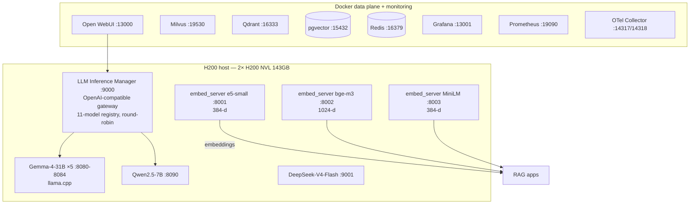
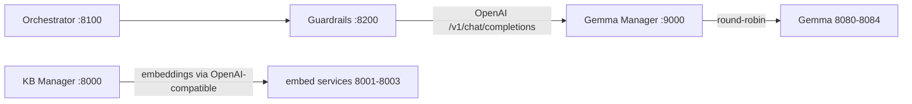

# Work RAG Server Setup — H200 Offline RAG Dev/Prod Environment

Provisioning, local model/embedding services, **Gemma LLM inference manager**, Open WebUI, and infrastructure for the Work Credit RAG platform.

> The full **verified runbook** (live-tested on `ai-gpu1`, 2× NVIDIA H200 NVL) is preserved at [`README.runbook.md`](README.runbook.md). This README gives the module overview, architecture, port map, and progress checklist.

## 1. Summary

This component owns **hardware, model lifecycle, container infrastructure, and frontend wiring**. It is responsible for:

1. Bootstrapping an H200 GPU host behind a corporate Squid proxy (scripts + offline-prep tooling).
2. Running **embedding microservices** (E5-small, BGE-M3, MiniLM) on ports 8001–8003.
3. Running an **LLM Inference Manager** gateway (port 9000) that load-balances 11 GGUF models (Gemma, Qwen, Nemotron, Llama, Mistral, Phi, DeepSeek) via llama.cpp across the two GPUs.
4. A Docker **data plane** (Milvus/Qdrant/pgvector/Redis/Open WebUI) plus a **monitoring stack** (Prometheus/Grafana/OpenTelemetry).
5. A **Persian 7-task benchmark harness** with generated reports and a GitHub Pages docs site.
6. End-to-end corpus + QA-ground-truth fixtures for smoke tests.

---

## 2. Architecture

### 2.1 Service topology



### 2.2 MVP integration point



---

## 3. Core services

### 3.1 Embedding services (`scripts/services/embed_server.py` → `Dockerfile.embed`)

One FastAPI/sentence-transformers server per model, exposing OpenAI-compatible `/v1/embeddings` (plus `/v1/models`, `/health`). L2-normalized float32 vectors.

| Container/service | Model | Dim |
|---|---|---|
| `:8001` | `intfloat/multilingual-e5-small` | 384 |
| `:8002` | `BAAI/bge-m3` | 1024 |
| `:8003` | `paraphrase-multilingual-MiniLM-L12-v2` | 384 |

```bash
curl -s http://127.0.0.1:8001/health   # {"status":"ok","model":"multilingual-e5-small","dim":384}
curl -s -X POST http://127.0.0.1:8001/v1/embeddings \
  -H "Content-Type: application/json" \
  -d '{"input":"گزارش اعتباری","model":"multilingual-e5-small"}'
```

### 3.2 Gemma Manager gateway (`llm_inference_manager/app.py`, port 9000)

A single OpenAI-compatible gateway in front of all llama.cpp backends.

- **11-model registry** (`MODEL_REGISTRY`): gemma-4-31b, gemma-3-27b, qwen3.8-27b, qwen3-30b-a3b, nemotron-49b, qwen2.5-7b, llama-3.2-3b, mistral-7b, phi-3-mini, deepseek-v4-flash, qwen2.5-72b (name/creator/family/params/size_gb/quant/path/context/license/benchmark/status/backends).
- **Round-robin** load balancing across the 5× Gemma backends (8080–8084) + Qwen (8090).
- **Session memory** via SQLite (`manager.db`): `chat_sessions`, `messages`; injects full history when `session_id` is provided.
- **Metrics** (latency per model) exposed via `/admin/metrics`.
- **On-demand model loading** — `/admin/models/load` spawns a new `llama_chat_server.py` on a free 8085–8100 port, auto-picks the GPU with most free memory.
- **Auth**: `verify_token` — anonymous in local dev; Bearer token must match an `api_tokens` row (seeded `sk-local-dev`).
- **Critical proxy fix**: `httpx.AsyncClient(timeout=120, trust_env=False)` bypasses Squid for localhost backends.
- Serves a **single-file HTML dashboard** (`/`, `/dashboard`).

```bash
# Model chat
curl -s http://127.0.0.1:9000/v1/chat/completions -X POST \
  -H "Content-Type: application/json" -H "Authorization: Bearer sk-local-dev" \
  -d '{"model":"gemma-4-31b","messages":[{"role":"user","content":"سلام"}]}'
```

### 3.3 llama.cpp chat server (`scripts/services/llama_chat_server.py`)

OpenAI-compatible per-backend server: `/v1/models`, `/health`, `/v1/chat/completions`, `/v1/completions`. Launched by `gemma_supervisor.sh` (5× Gemma on 8080–8084, GPU split: GPU0→8080/8082/8084, GPU1→8081/8083, infinite auto-restart loop) and by `llama.launch_model`.

---

## 4. Port map

| Port | Service |
|---|---|
| 8001 / 8002 / 8003 | embeddings (e5-small / bge-m3 / MiniLM) |
| 8080–8084 | 5× Gemma-4-31B (llama.cpp) |
| 8090 | Qwen2.5-7B |
| 9000 | **LLM Inference Manager gateway** (OpenAI-compatible) |
| 9001 | DeepSeek-V4-Flash wrapper |
| 9621 | LightRAG |
| 13000 | Open WebUI |
| 15432 | pgvector (Docker) |
| 16333 / 16334 | Qdrant (Docker) |
| 16379 | Redis (Docker) |
| 19530 | Milvus (Docker) |
| 13001 / 19090 / 19100 | Grafana / Prometheus / node-exporter |
| 14317 / 14318 / 19092 | OTel gRPC / HTTP / prometheus export |

---

## 5. Data plane & monitoring (`deploy/`)

### 5.1 docker-compose (`deploy/docker-compose.yml`)

| Container | Port | Purpose |
|---|---|---|
| `redis` | 16379 | cache / queue |
| `qdrant` | 16333 | vector store |
| `pgvector` | 15432 | postgres + pgvector |
| `milvus` | 19530 | vector store (standalone, embedded etcd+MinIO) |
| `open-webui` | 13000 | UI (`WEBUI_AUTH=false`) |

`setup_data_plane.py` idempotently creates the **`rag_docs`** collection (dim 384, COSINE) across all three vector stores and writes `deploy/data_plane_status.json`.

### 5.2 Monitoring (`deploy/monitoring/`)

| Service | Port | Notes |
|---|---|---|
| Prometheus | 19090 | scrapes vLLM `:8000/metrics`, GPU `:9101`, node `:9100`, 15s |
| Grafana | 13001 | auto-provisioned Prometheus datasource |
| OTel collector | 14317/14318/19092 | OTLP gRPC/HTTP + prometheus export |

### 5.3 Gateway (`deploy/gateway/`)

Nginx landing pages for `:8088`/`:8080` reverse-proxying `/vllm/`, `/llama/`, `/embeddings/`, `/webui/`, `/grafana/`, `/prometheus/`, `/qdrant/`, `/milvus/`, `/docs/`. `.public.html` adds HTTP Basic Auth for Cloudflare-tunnel public access.

---

## 6. Offline provisioning behind the proxy

| Script | Purpose |
|---|---|
| `start.sh` | Bootstraps Ubuntu: apt deps, Docker (+ daemon proxy), venv, launches `offline_prepare_cli.py` in tmux |
| `proxy_setup.sh` | Persists Squid proxy env + apt + git + docker daemon config |
| `fix_env.sh` | Rebuilds a broken `prep_venv` (python3.12 + huggingface-hub + transformers) |
| `offline_prepare_cli.py` | Self-healing downloader/installer: state machine + retry queue; downloads Docker images, CUDA/torch wheels, HF models (17 repos), sample projects (Dify, AnythingLLM, RAGFlow, LightRAG) |

All work relative to `offline-prep/` (gitignored: models, tars, wheels, venvs, logs).

---

## 7. Benchmark harness & docs

- `scripts/eval_persian.py` — Persian 7-task evaluation harness.
- `scripts/gen_eval_report.py`, `gen_prompt_compare.py`, `gen_sample_questions.py`, `gen_pages.py` — report/render pipeline.
- `scripts/download_*.py` — proxy-resilient downloads (models, embeddings, eval data, Persian eval).
- `scripts/services/gpu_metrics_exporter.py` — pure-stdlib Prometheus metrics from `nvidia-smi`.
- **Docs site** (GitHub Pages): https://alinikkhah2001.github.io/Work_RAG-Server-Setup/ — benchmark results, plots, history. Built by `.github/workflows/pages.yml` + `docs-site/`.
- `e2e-test/` — `qa_ground_truth.json` (10 QA pairs) + 11 corpus markdown docs consumed by `scripts/rag_test_harness.py`.

---

## 8. Run / verify

```bash
# 1. Provision the host (first time)
bash start.sh                 # then interact with offline-prep CLI in tmux: offline_prep

# 2. Proxy (every shell)
export http_proxy=http://192.168.203.2:3128 https_proxy=http://192.168.203.2:3128
source proxy_setup.sh

# 3. Start services
nvidia-smi                    # expect 2× H200
offline-prep/venv/bin/python3.12 -m pip install -r requirements.txt

docker compose -f deploy/docker-compose.yml up -d
python scripts/services/embed_server.py --model multilingual-e5-small --port 8001 &
python llm_inference_manager/app.py &        # port 9000

# 4. Verify
curl -s http://127.0.0.1:9000/health
curl -s http://127.0.0.1:9000/v1/models
bash llm_inference_manager/test_manager.sh    # curl suite -> logs/manager_test_*.json
```

> **Windows dev tip:** this module is designed for the Linux GPU host. On a local Windows box, the MVP path uses `scripts/mock_gemma_manager.py` in the parent repo instead of the manager — everything downstream (Orchestrator/Guardrails) is agnostic to that because it only talks OpenAI-compatible HTTP.

---

## 9. Repository layout (key entries)

```text
components/server-setup/
├── README.md / README.runbook.md   # module README + preserved verified runbook
├── start.sh / fix_env.sh / proxy_setup.sh / offline_prepare_cli.py
├── Dockerfile.embed
├── deploy/
│   ├── docker-compose.yml / setup_data_plane.py / recreate_webui.sh
│   ├── gateway/                    # nginx landing pages
│   └── monitoring/                 # prometheus, grafana, otel
├── docs/                           # reports, guides, history 001-010
├── docs-site/                      # Jekyll GitHub Pages site
├── e2e-test/                       # QA ground truth + corpus
├── llm_inference_manager/
│   ├── app.py / Dockerfile / requirements.txt / test_manager.sh
└── scripts/
    ├── services/                   # llama_chat_server, embed_server, gpu_metrics_exporter...
    └── ...                            # eval, report, download, verify tooling
```

---

## 10. Planning & progress checklist

### P0 — Host bootstrap (done)

- [x] Hardware/OS verified (2× H200 NVL 143GB, driver 580.173.02, CUDA 13.0)
- [x] Proxy plumbing (env / apt / git / docker daemon)
- [x] `prep_venv` master venv + verification
- [x] `offline_prepare_cli.py` self-healing downloader (Docker images, wheels, HF models, sample projects)
- [x] Docker data plane (redis/qdrant/pgvector/milvus/open-webui) up
- [x] Embedding services live (8001–8003)

### P1 — LLM services (in progress)

- [x] `llama_chat_server.py` OpenAI-compatible backend
- [x] 5× Gemma-4-31B on 8080–8084 (`gemma_supervisor.sh`) + Qwen2.5-7B 8090
- [x] **Gemma Manager gateway :9000** (11-model registry, round-robin, sessions, metrics, dashboard)
- [x] `/v1/models` + `/v1/chat/completions` verified
- [x] `Dockerfile.embed` + `llm_inference_manager/Dockerfile` added (MVP build path)
- [ ] DeepSeek-V4-Flash production load (9001)
- [ ] vLLM single-file GGUF serving on :8000 (nominal, not running)

### P2 — Data plane & monitoring (partially live)

- [x] Milvus/Qdrant/pgvector/Redis collections created (`rag_docs`, dim 384, COSINE)
- [x] Prometheus/Grafana/OTel stack running
- [ ] GPU/metrics dashboards wired into Grafana sub-path
- [ ] LightRAG live wiring on :9621

### P3 — Benchmarks & reports

- [x] Persian 7-task eval harness + reports
- [x] GitHub Pages docs site publishing
- [ ] Re-run eval against current corpus snapshot
- [ ] Speed benchmarks persisted per GGUF

### P4 — E2E & hardening

- [x] `e2e-test/` corpus + QA ground truth + `rag_test_harness.py`
- [x] `trust_env=False` localhost proxy bypass (manager + llama)
- [ ] Re-render runbook paths `/ai-gpu1/...` → live `/splunk-data/v1/...`
- [ ] Auth token rotation + admin RBAC
- [ ] Disk/report retention policy

### P5 — Future

- [ ] Kubernetes rollout (vs compose data plane)
- [ ] GPU auto-scaling model placement
- [ ] Public tunnel hardening (Basic Auth → SSO)

---

## 11. Known gotchas

- `offline-prep/venv/bin/python3.12 -m pip` — **never bare `pip`** (shebangs point at dead `/ai-gpu1/...`).
- `.state.json` / `.retry_queue.json` are stale — treat as history.
- `numpy`/`scipy` conflict → pin `scipy==1.13.1`.
- Localhost calls must bypass the Squid proxy → `trust_env=False`.
- The module is Linux/GPU-oriented; Windows workstations use the parent repo's mock Gemma as a drop-in OpenAI-compatible replacement.

---

## License

See parent repository `LICENSE` and the submodule's own obligations.